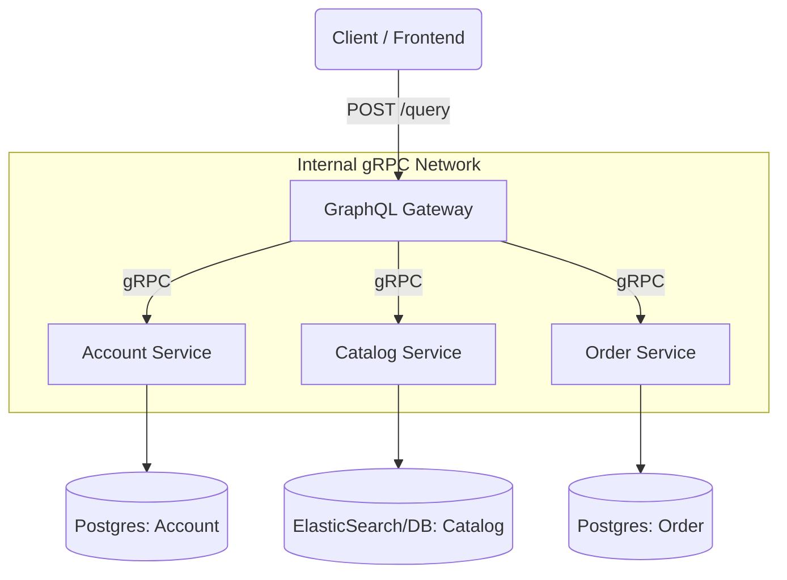

# Go Microservices E-Commerce Backend


This project demonstrates a production-ready microservices architecture built with **Golang**. It simulates an e-commerce backend where distinct business domains (Accounts, Catalog, Orders) are separated into independent services.

The system uses a **GraphQL Gateway** as the public-facing entry point, which aggregates data from backend services communicating internally via high-performance **gRPC**.

### Architecture

The architecture follows the **API Gateway Pattern**. The `graphql` service acts as the orchestrator, decoupling the client from the backend complexity.



# Service Definitions & Paths
The project is structured into four main directories, each representing a service or gateway. Below are the methods and paths defined in the code logic:

## **1. Account Service (/account)**
Responsible for user identity, authentication, and profile management.

Protocol: gRPC

Key Methods:

CreateUser(ctx, name, email, password): Handles user registration and database insertion.

GetUser(ctx, id): Fetches user entity by ID.

Logic: Implements strict validation on email/password before storage.

## **2. Catalog Service (/catalog)**
Manages the inventory of products. Designed for high-read throughput.

Protocol: gRPC

Key Methods:

PostProduct(ctx, name, description, price): Admin capability to add new items to the inventory.

GetProduct(ctx, id): Retrieves specific product details.

GetProducts(ctx, skip, take): Batch retrieval method supporting pagination for browsing.

## **3. Order Service (/order)**
Handles the lifecycle of a purchase.

Protocol: gRPC

Key Methods:

PostOrder(ctx, accountID, products[]): Creates a new transaction.

GetOrdersForAccount(ctx, accountID): Returns order history for a specific user.

Logic: This service communicates with Catalog (to check stock) and Account (to validate user) before finalizing an order.

## **4. GraphQL Gateway (/graphql)**
The entry point for the application.

Protocol: HTTP / GraphQL

Endpoint: http://localhost:8080/graphql

Playground: http://localhost:8080/

Role: Resolves GraphQL queries by calling the appropriate gRPC client methods defined in the services above.

## Getting Started
**Prerequisites**
Go: v1.18 or higher

Docker & Docker Compose

Make (Optional)

### **Installation & Run**

The entire suite is containerized. You can spin up the database and all services with a single command.

**Clone the repository**

```Bash
git clone [https://github.com/AryanParashar24/go-microservices-project.git](https://github.com/AryanParashar24/go-microservices-project.git)
cd go-microservices-project
```

Run with Docker Compose

```Bash
docker-compose up --build
```
This will start the **Account, Catalog, Order, and GraphQL** services along with their required databases.

Verify the Deployment Visit the GraphQL Playground to interact with the API: 👉 http://localhost:8080/
